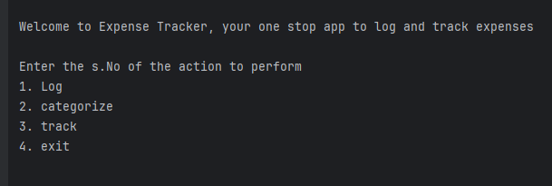
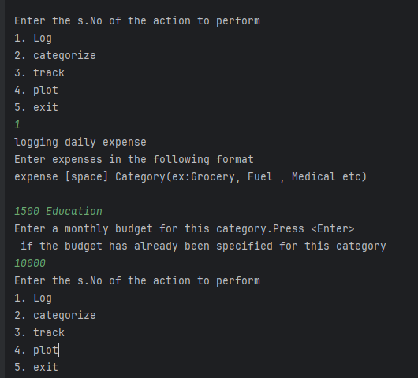
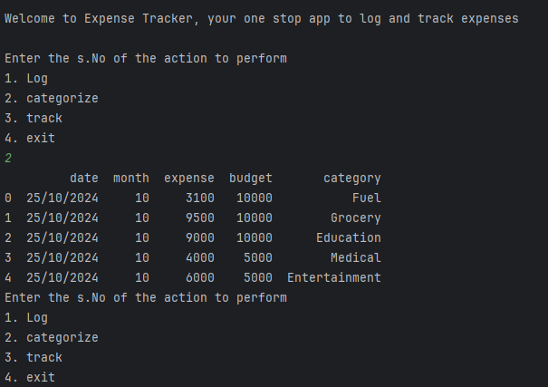
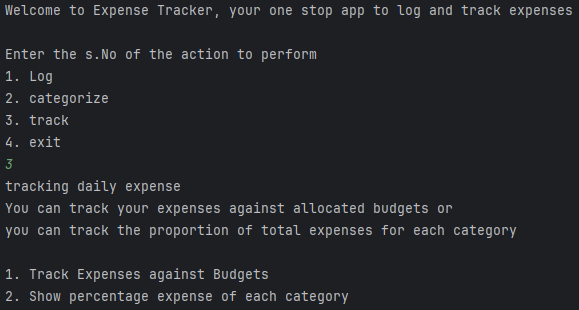
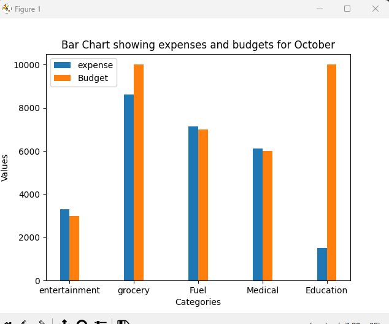
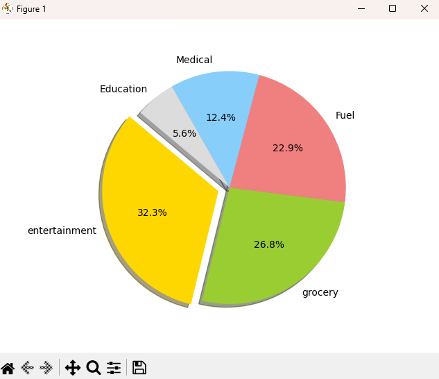

## Personal Expense Tracker ##

### User Cases ###

1. Enter daily expenses under various categories
2. Categorize expenses 
3. Track expenses vis-a-vis budget allocated

### Implementation ###
Implemented as a CLI application

## Screen shots ##

### Opening Screen ###

### log expenses Screen ###

### Categorize Screen ###

### Tracking Screen ###

### Tracking- Budget vs Expenses graph Screen ###

### Tracking- Expenses Pie Chart ###

